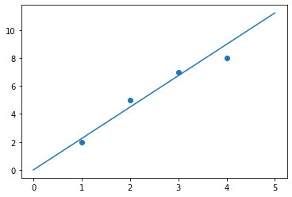
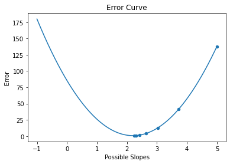

# Linear Regression by Gradient Descent
This code takes any set of 2D data points and finds a line of best fit through it by using gradient descent.

We make the assumption that the y-intercept is 0.

